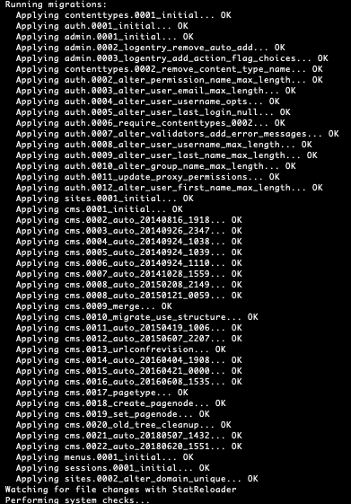
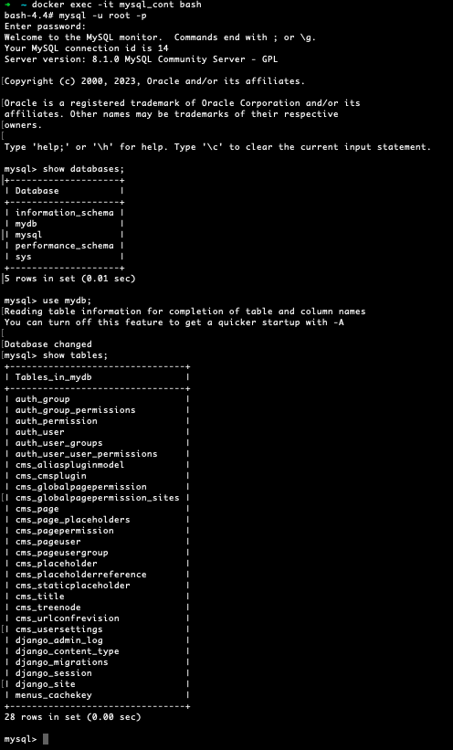
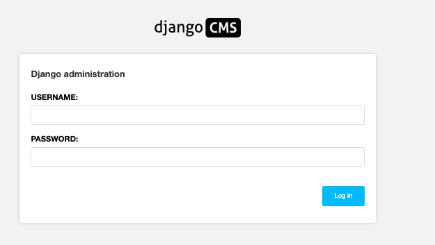
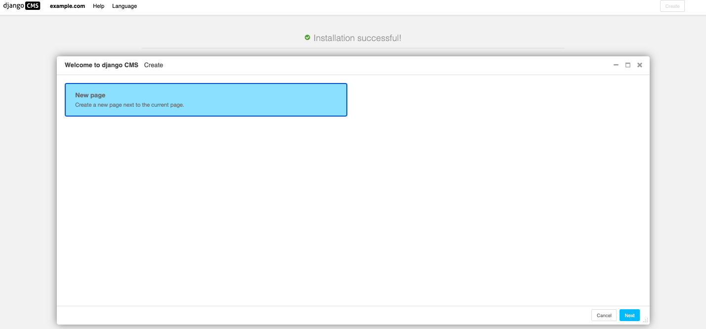
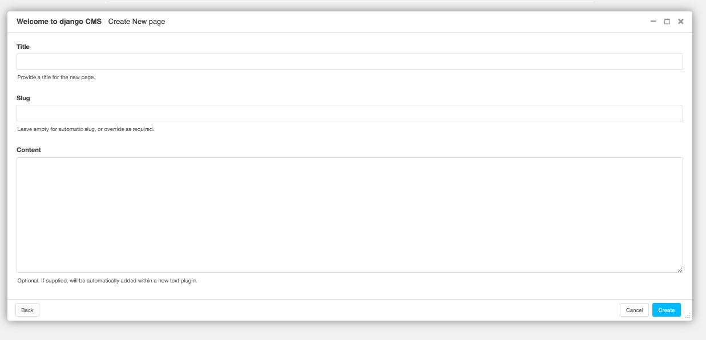
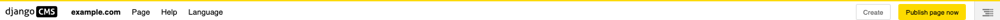
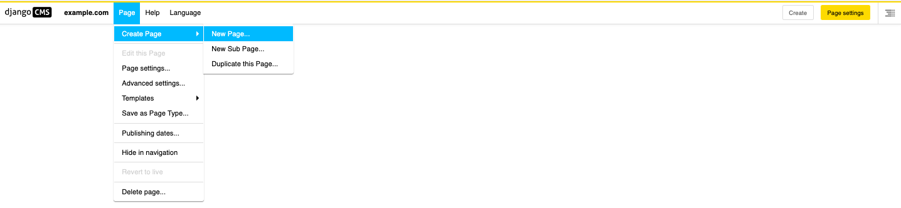
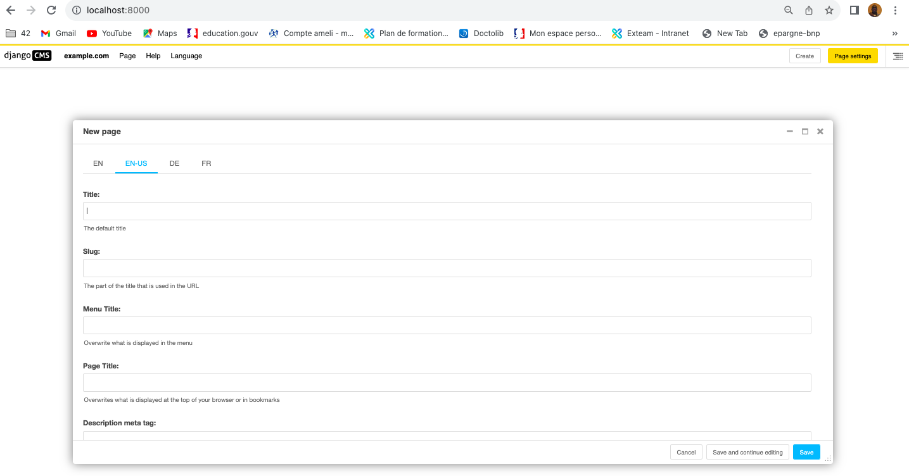

<h3  style="color:blue">DJANGOCMS PROCESS LOCALLY </h3>

<h3  style="color:red">A- Make Djangocms run locally LOCALLY </h3>

<h3  style="color:cyan">1 - Install Virtualenv and Activate it </h3>

```
python3 -m venv venv # create a virtualenv
```

```
source venv/bin/activate  # activate it
```


<h3  style="color:cyan">2 - Install Django </h3>


```
pip install django==3.2
```

```
pip install django-cms
```


<h3  style="color:cyan">3 - Create new project </h3>

```
django-admin startproject my_blog_project
```

Now, your directory content :
```
- GIT_DJANGOCMS_TUTO
- my_blog_project
    my_blog_project
        __init__.py
        asgi.py
        settings.py
        urls.py
        wsgi.py
    manage.py
```

<h3  style="color:cyan">4 -Minimal settings.py Content </h3>

<pre>
"""
Django settings for my_blog_project project.

Generated by 'django-admin startproject' using Django 3.2.

For more information on this file, see
https://docs.djangoproject.com/en/3.2/topics/settings/

For the full list of settings and their values, see
https://docs.djangoproject.com/en/3.2/ref/settings/

# ## https://github.com/Apress/beg-django-cms/blob/master/978-1-4842-1670-5-source/myblog/settings.py
"""

import os 
from pathlib import Path
from django.utils.translation import gettext_lazy as _
gettext = lambda s: s

# Build paths inside the project like this: BASE_DIR / 'subdir'.
BASE_DIR = Path(__file__).resolve().parent.parent


# Quick-start development settings - unsuitable for production
# See https://docs.djangoproject.com/en/3.2/howto/deployment/checklist/

# SECURITY WARNING: keep the secret key used in production secret!
SECRET_KEY = 'django-insecure-+)0vos6@f()*xs-+&o52!0j=d$yd=k6bf^p@7=+7jm#r4gg=w%'

# SECURITY WARNING: don't run with debug turned on in production!
DEBUG = True

ALLOWED_HOSTS = [  '*' ]

X_FRAME_OPTIONS = 'SAMEORIGIN'
SITE_ID = 1

TEMPLATE_LOADERS = (
    'django.template.loaders.filesystem.Loader',
    'django.template.loaders.app_directories.Loader',
    'django.template.loaders.eggs.Loader'
)


MEDIA_URL = '/media/'
MEDIA_ROOT = os.path.join(BASE_DIR, 'my_blog_app', 'media')

STATIC_URL = '/static/'
STATIC_ROOT = os.path.join(BASE_DIR,   'staticfiles') ## python manage.py collectstatic will creat this dir and store all satic files from all application hre

STATICFILES_DIRS = (
    os.path.join(BASE_DIR, 'my_blog_app',  'static'), #he my_blog_app static files path application
)


# Application definition

INSTALLED_APPS = [
    'djangocms_admin_style',
    'django.contrib.admin',
    'django.contrib.auth',
    'django.contrib.contenttypes',
    'django.contrib.sessions',
    'django.contrib.messages',
    'django.contrib.staticfiles',
    'django.contrib.sites',
    'cms',
    'menus',
    'treebeard',
    'sekizai',

    # -- my applications ---
    'my_blog_app'


]

MIDDLEWARE = [
    'django.middleware.security.SecurityMiddleware',
    'django.contrib.sessions.middleware.SessionMiddleware',
    'django.middleware.common.CommonMiddleware',
    'django.middleware.csrf.CsrfViewMiddleware',
    'django.contrib.auth.middleware.AuthenticationMiddleware',
    'django.contrib.messages.middleware.MessageMiddleware',
    'django.middleware.clickjacking.XFrameOptionsMiddleware',

    'cms.middleware.user.CurrentUserMiddleware',
    'cms.middleware.page.CurrentPageMiddleware',
    'cms.middleware.toolbar.ToolbarMiddleware',
    'cms.middleware.language.LanguageCookieMiddleware',

    'django.middleware.locale.LocaleMiddleware'
]


ROOT_URLCONF = 'my_blog_project.urls'


TEMPLATES = [
    {
        'BACKEND': 'django.template.backends.django.DjangoTemplates',
        'DIRS': [    
            os.path.join(BASE_DIR, 'my_blog_app', 'templates' ),
        ],
        'APP_DIRS': True,
        'OPTIONS': {
            'context_processors': [
                'django.template.context_processors.debug',
                'django.template.context_processors.request',
                'django.contrib.auth.context_processors.auth',
                'django.contrib.messages.context_processors.messages',
                'sekizai.context_processors.sekizai',
                'cms.context_processors.cms_settings',
                'django.template.context_processors.i18n',
            ],
        },
    },
]

WSGI_APPLICATION = 'my_blog_project.wsgi.application'


# Database
# https://docs.djangoproject.com/en/3.2/ref/settings/#databases

DATABASES = {
    'default': { # This is th default database, you can keep only this in django (but in djangocms it won't work, you need the second below)
        'ENGINE': os.environ.get("DJANGO_SETTING_DATABASE_ENGINE"),
        'NAME': os.environ.get("DJANGO_SETTING_DATABASE_NAME"),
        'HOST': os.environ.get("DJANGO_SETTING_DATABASE_HOST"), #this must be he same as database service name inside your docker-compose file
        'PASSWORD':  os.environ.get("DJANGO_SETTING_DATABASE_ROOT_PASSWORD"),
        'PORT': os.environ.get("DJANGO_SETTING_DATABASE_PORT"),
        'USER': os.environ.get("DJANGO_SETTING_DATABASE_ROOT_USER")
    },

    '{}'.format(os.environ.get("DJANGO_SETTING_DATABASE_NAME")): {
        'ENGINE': os.environ.get("DJANGO_SETTING_DATABASE_ENGINE"),
        'NAME': os.environ.get("DJANGO_SETTING_DATABASE_NAME"),
        'HOST': os.environ.get("DJANGO_SETTING_DATABASE_HOST"), #this must be he same as database service name inside your docker-compose file
        'PASSWORD':  os.environ.get("DJANGO_SETTING_DATABASE_ROOT_PASSWORD"),
        'PORT': os.environ.get("DJANGO_SETTING_DATABASE_PORT"),
        'USER': os.environ.get("DJANGO_SETTING_DATABASE_ROOT_USER")
    }
}


# Password validation
# https://docs.djangoproject.com/en/3.2/ref/settings/#auth-password-validators

AUTH_PASSWORD_VALIDATORS = [
    {
        'NAME': 'django.contrib.auth.password_validation.UserAttributeSimilarityValidator',
    },
    {
        'NAME': 'django.contrib.auth.password_validation.MinimumLengthValidator',
    },
    {
        'NAME': 'django.contrib.auth.password_validation.CommonPasswordValidator',
    },
    {
        'NAME': 'django.contrib.auth.password_validation.NumericPasswordValidator',
    },
]


# Internationalization
# https://docs.djangoproject.com/en/3.2/topics/i18n/

LANGUAGE_CODE = 'en-us'

TIME_ZONE = 'UTC'

USE_I18N = True

USE_L10N = True

USE_TZ = True


# Static files (CSS, JavaScript, Images)
# https://docs.djangoproject.com/en/3.2/howto/static-files/

STATIC_URL = '/static/'

# Default primary key field type
# https://docs.djangoproject.com/en/3.2/ref/settings/#default-auto-field

DEFAULT_AUTO_FIELD = 'django.db.models.BigAutoField'

LANGUAGE_CODE = 'en-us'

LANGUAGES = (
    ## Customize this
    ('en-us', _('American English')),
    ('en', _('English')),
    ('de', _('Deutsch')),
    ('fr', _('French'))
)

CMS_LANGUAGES = {
    ## Customize this
    'default': {
        'public': True,
        'hide_untranslated': False,
        'redirect_on_fallback': True,
    },
    1: [
        {
            'public': True,
            'code': 'en',
            'hide_untranslated': False,
            'name': gettext('en'),
            'redirect_on_fallback': True,
        },

        {
            'public': True,
            'code': 'en-us',
            'hide_untranslated': False,
            'name': gettext('en-us'),
            'redirect_on_fallback': True,
        },

        {
            'public': True,
            'code': 'de',
            'hide_untranslated': False,
            'name': gettext('de'),
            'redirect_on_fallback': True,
        },

        {
            'public': True,
            'code': 'fr',
            'hide_untranslated': False,
            'name': gettext('fr'),
            'redirect_on_fallback': True,
        },
    ],
}

CMS_TEMPLATES = [
    ('blog/child.html', 'Page Home'),
    #('blog/home.html', 'Page Home'),
    #('utils/page.html', 'Page'),
    #('blog/blogpage.html', 'Blog Page with Sidebar')
]
</pre>

<h3  style="color:cyan">9 -Collect Static files from all applications (here we have only one called my_blog_app) </h3>

```
 python manage.py collectstatic
```
This will create a staticfiles files directories and collect all project static dir files and put them in staticfiles directory
as we indicaed here in settings.py : STATIC_ROOT = os.path.join(BASE_DIR,   'staticfiles')


<h3  style="color:cyan">10 -Create database tables  </h3>

```
python manage.py makemigrations

python manage.py migrate
```


Now, if you connect to your mysql database,


<h3  style="color:cyan">11 -Run server </h3>

```
 python manage.py runserver  
```

Th result to show that server is running is:
```
System check identified no issues (0 silenced).
August 26, 2023 - 21:03:39
Django version 3.2, using settings 'my_blog_project.settings'
Starting development server at http://127.0.0.1:8000/
Quit the server with CONTROL-C.
```

Now , in your browser:http://127.0.0.1:8000/
 

Fill your crednial(username, password), This is will lead you to:
 

Now , you can fill your blog content 



<h3  style="color:cyan">10 -Create New Application inside your project my_blog_project </h3>

```
python manage.py startapp my_blog_app
```

<h3  style="color:cyan">11 - Some template tags explication in base.html </h3>
create a my_blog_project/templates directory (where we have settings.py fil) and base.html file innside

<ol>
<li style="margin-bottom:20px;"><em> <span style="color:red"></span> and <span style="color:red"></span>:help us display cms_toolbar with css style </em>
    
</li>

<li style="margin-bottom:20px;"><em><span style="color:red"></span>: help us click on menu and open sub-mnu</em>

</li>

<li style="margin-bottom:20px;"><em><span style="color:red"></span>: help us click on menu and open sub-mnu</em>

</li>

</ol>
<h3  style="color:red">B- Make Djangocms run locally LOCALLY </h3>
